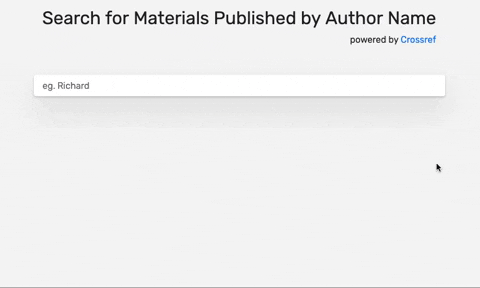

## 介绍

响应式编程是一种涉及异步数据流的范例，其中编程模型将所有内容视为随时间推移的数据流。 这包括击键，HTTP 请求，要打印的文件，甚至是数组的元素，可以认为这些元素在非常小的时间间隔内定时。 这使得它非常适合 JavaScript，因为异步数据在语言中很常见。

[RxJS]() 是一个用于 JavaScript 中的反应式编程的流行库。 ReactiveX 是 RxJS 所依赖的保护伞，它在 Java ， Python ， C ++ ， Swift 和 Dart 等许多其他语言中都有扩展。 RxJS 也被 Angular 和 React 等图书馆广泛使用。

> RxJS 的实现基于链接的函数，这些函数知道并且能够在一段时间内处理数据。 这意味着可以实现 RxJS 的几乎每个方面，只需要接收参数和回调列表的函数，然后在发出信号时执行它们。 围绕 RxJS 的社区已经完成了这个繁重的工作，结果是一个 API，您可以直接在任何应用程序中使用它来编写干净和可维护的代码。

在本教程中，您将使用 RxJS 构建功能丰富的搜索栏，以便向用户返回实时结果。 您还将使用 HTML 和 CSS 格式化搜索栏。 最终结果将是这样的：



像搜索栏一样常见且看似简单的东西需要进行各种检查。 本教程将向您展示 RxJS 如何将一组相当复杂的需求转换为易于理解且易于理解的代码。

> 效果预览

<iframe height="359" style="width: 100%;" scrolling="no" title="Vue search filter" src="https://codepen.io/AndrewThian/embed/QdeOVa?height=359&theme-id=dark&default-tab=js,result" frameborder="no" loading="lazy" allowtransparency="true" allowfullscreen="true">
  See the Pen <a href='https://codepen.io/AndrewThian/pen/QdeOVa'>Vue search filter</a> by Andrew thian
  (<a href='https://codepen.io/AndrewThian'>@AndrewThian</a>) on <a href='https://codepen.io'>CodePen</a>.
</iframe>

## 先决条件

在开始本教程之前，您需要以下内容：

- 支持 JavaScript 语法突出显示的文本编辑器，例如 Atom ， Visual Studio Code 或 Sublime Text 。 这些编辑器可在 Windows，macOS 和 Linux 上使用。
- 熟悉一起使用 HTML 和 JavaScript。 详细了解如何将 JavaScript 添加到 HTML 。
- 熟悉 JSON 数据格式，您可以在 JavaScript 中了解如何使用 JSON 。

Github 上提供了本教程的[完整代码]()。

## 编码实现

### 创建搜索栏并设置样式

在此步骤中，您将使用 HTML 和 CSS 创建搜索栏并设置样式。 代码将使用 [Bootstrap]() 中的一些常用元素来加速页面的结构化和样式化过程，以便您可以专注于添加自定义元素。 Bootstrap 是一个 CSS 框架，包含常用元素的模板，如排版，表单，按钮，导航，网格和其他界面组件。 您的应用程序还将使用 [Animate.css]() 将动画添加到搜索栏。

您将从使用 nano 或您喜欢的文本编辑器创建名为 search-bar.html 的文件开始：

```html:title=search-bar.html
<!DOCTYPE html>
<html>
  <head>
    <title>RxJS Tutorial</title>
    <!-- Load CSS -->

    <!-- Load Rubik font -->

    <!-- Add Custom inline CSS -->
  </head>

  <body>
    <!-- Content -->

    <!-- Page Header and Search Bar -->

    <!-- Results -->

    <!-- Load External RxJS -->

    <!-- Add custom inline JavaScript -->
    <script></script>
  </body>
</html>
```

当您需要整个 Bootstrap 库中的 CSS 时，请继续加载 Bootstrap 和 Animate.css 的 CSS。

在 Load CSS 注释下添加以下代码：

```html
<link
  rel="stylesheet"
  href="https://stackpath.bootstrapcdn.com/bootstrap/4.2.1/css/bootstrap.min.css"
  integrity="sha384-GJzZqFGwb1QTTN6wy59ffF1BuGJpLSa9DkKMp0DgiMDm4iYMj70gZWKYbI706tWS"
  crossorigin="anonymous"
/>
<link
  rel="stylesheet"
  href="https://cdnjs.cloudflare.com/ajax/libs/animate.css/3.7.0/animate.min.css"
/>
..
```

本教程将使用 Google Fonts 库中名为 Rubik 的自定义字体来设置搜索栏的样式。 通过在 Load Rubik font 注释下添加突出显示的代码来 Load Rubik font ：

```html
<style>
  body {
    background-color: #f5f5f5;
    font-family: "Rubik", sans-serif;
  }

  .search-container {
    margin-top: 50px;
  }
  .search-container .search-heading {
    display: block;
    margin-bottom: 50px;
  }
  .search-container input,
  .search-container input:focus {
    padding: 16px 16px 16px;
    border: none;
    background: rgb(255, 255, 255);
    box-shadow: 0 2px 4px 0 rgba(0, 0, 0, 0.2), 0 25px 50px 0 rgba(0, 0, 0, 0.1) !important;
  }

  .results-container {
    margin-top: 50px;
  }
  .results-container .list-group .list-group-item {
    background-color: transparent;
    border-top: none !important;
    border-bottom: 1px solid rgba(236, 229, 229, 0.64);
  }

  .float-bottom-right {
    position: fixed;
    bottom: 20px;
    left: 20px;
    font-size: 20px;
    font-weight: 700;
    z-index: 1000;
  }
  .float-bottom-right .info-container .card {
    display: none;
  }
  .float-bottom-right .info-container:hover .card,
  .float-bottom-right .info-container .card:hover {
    display: block;
  }
</style>
```

这使用 Bootstrap 的网格系统来构建页眉和搜索栏。 您已将 search-input 标识符分配给搜索栏，您将在本教程后面将其用于绑定到监听器。

接下来，您将创建一个位置以显示搜索结果。 在 Results 注释下，使用 response-list 标识符创建一个 div ，以便在教程的后面添加结果：

```html
<div class="container results-container">
  <div class="row justify-content-center">
    <div class="col-sm-8">
      <ul id="response-list" class="list-group list-group-flush"></ul>
    </div>
  </div>
</div>
```

此时， search-bar.html 文件将如下所示：

```html:title=search-bar.html
<!DOCTYPE html>
<html>
  <head>
    <title>RxJS Tutorial</title>
    <!-- Load CSS -->
    <link
      rel="stylesheet"
      href="https://stackpath.bootstrapcdn.com/bootstrap/4.2.1/css/bootstrap.min.css"
      integrity="sha384-GJzZqFGwb1QTTN6wy59ffF1BuGJpLSa9DkKMp0DgiMDm4iYMj70gZWKYbI706tWS"
      crossorigin="anonymous"
    />
    <link
      rel="stylesheet"
      href="https://cdnjs.cloudflare.com/ajax/libs/animate.css/3.7.0/animate.min.css"
    />

    <!-- Load Rubik font -->
    <link
      href="https://fonts.googleapis.com/css?family=Rubik"
      rel="stylesheet"
    />

    <!-- Add Custom inline CSS -->
    <style>
      body {
        background-color: #f5f5f5;
        font-family: "Rubik", sans-serif;
      }

      .search-container {
        margin-top: 50px;
      }
      .search-container .search-heading {
        display: block;
        margin-bottom: 50px;
      }
      .search-container input,
      .search-container input:focus {
        padding: 16px 16px 16px;
        border: none;
        background: rgb(255, 255, 255);
        box-shadow: 0 2px 4px 0 rgba(0, 0, 0, 0.2), 0 25px 50px 0 rgba(0, 0, 0, 0.1) !important;
      }

      .results-container {
        margin-top: 50px;
      }
      .results-container .list-group .list-group-item {
        background-color: transparent;
        border-top: none !important;
        border-bottom: 1px solid rgba(236, 229, 229, 0.64);
      }

      .float-bottom-right {
        position: fixed;
        bottom: 20px;
        left: 20px;
        font-size: 20px;
        font-weight: 700;
        z-index: 1000;
      }
      .float-bottom-right .info-container .card {
        display: none;
      }
      .float-bottom-right .info-container:hover .card,
      .float-bottom-right .info-container .card:hover {
        display: block;
      }
    </style>
  </head>

  <body>
    <!-- Content -->
    <!-- Page Header and Search Bar -->
    <div class="container search-container">
      <div class="row justify-content-center">
        <div class="col-md-auto">
          <div class="search-heading">
            <h2>Search for Materials Published by Author Name</h2>
            <p class="text-right">
              powered by <a href="https://www.crossref.org/">Crossref</a>
            </p>
          </div>
        </div>
      </div>
      <div class="row justify-content-center">
        <div class="col-sm-8">
          <div class="input-group input-group-md">
            <input
              id="search-input"
              type="text"
              class="form-control"
              placeholder="eg. Richard"
              aria-label="eg. Richard"
              autofocus
            />
          </div>
        </div>
      </div>
    </div>

    <!-- Results -->
    <div class="container results-container">
      <div class="row justify-content-center">
        <div class="col-sm-8">
          <ul id="response-list" class="list-group list-group-flush"></ul>
        </div>
      </div>
    </div>

    <!-- Load RxJS -->

    <!-- Add custom inline JavaScript -->
    <script></script>
  </body>
</html>
```

### 编写 JavaScript

现在您已经格式化了搜索栏，您已准备好编写 JavaScript 代码，该代码将作为您将在本教程后面编写的 RxJS 代码的基础。 此代码将与 RxJS 一起使用以接受搜索词并返回结果。

由于您不需要本教程中 Bootstrap 和 JavaScript 提供的功能，因此您不会加载它们。 但是，您将使用 RxJS。 通过在 Load RxJS 注释下添加以下内容来加载 RxJS 库：

```html
<script src="https://unpkg.com/@reactivex/rxjs@5.0.3/dist/global/Rx.js"></script>
```

现在，您将存储要添加结果的 HTML 的 div 引用。 在 Add custom inline JavaScript 注释下的`<script>`标记中添加突出显示的 JavaScript 代码：

```html
<script>
  const output = document.getElementById("response-list")
</script>
```

接下来，添加代码以将来自 API 的 JSON 响应转换为 HTML 元素以显示在页面上。 此代码将首先清除搜索栏的内容，然后为搜索结果动画设置延迟。

在`<script>`标记之间添加突出显示的函数：

```html
<script>
  const output = document.getElementById("response-list")

  function showResults(resp) {
    var items = resp["message"]["items"]
    output.innerHTML = ""
    animationDelay = 0
    if (items.length == 0) {
      output.innerHTML = "Could not find any :("
    } else {
      items.forEach(item => {
        resultItem = `
            <div class="list-group-item animated fadeInUp" style="animation-delay: ${animationDelay}s;">
              <div class="d-flex w-100 justify-content-between">
<^>                <h5 class="mb-1">${
          (item["title"] && item["title"][0]) || "&lt;Title not available&gt;"
        }</h5>
              </div>
              <p class="mb-1">${
                (item["container-title"] && item["container-title"][0]) || ""
              }</p>
              <small class="text-muted"><a href="${
                item["URL"]
              }" target="_blank">${item["URL"]}</a></small>
              <div> 
                <p class="badge badge-primary badge-pill">${
                  item["publisher"] || ""
                }</p>
                <p class="badge badge-primary badge-pill">${
                  item["type"] || ""
                }</p> 
             </div>
            </div>
            `
        output.insertAdjacentHTML("beforeend", resultItem)
        animationDelay += 0.1
      })
    }
  }
</script>
```

以 `if` 开头的代码块是检查搜索结果的条件循环，如果没有找到结果则显示消息。 如果找到结果，那么 `forEach` 循环将为用户提供动画结果。

在这一步中，您通过写出一个可以接受结果并在页面上返回结果的函数来为 RxJS 奠定基础。 在下一步中，您将使搜索栏正常运行。

### 设置监听器

RxJS 关注数据流，在这个项目中，数据流是用户输入到输入元素或搜索栏的一系列字符。 在此步骤中，您将在 input 元素上添加一个监听器以监听更新。

首先，记下您在本教程前面添加的 search-input 标识符：

```html
<input
  id="search-input"
  type="text"
  class="form-control"
  placeholder="eg. Richard"
  aria-label="eg. Richard"
  autofocus
/>
```

接下来，创建一个包含 search-input 元素引用的变量。 这将成为代码将用于监听输入事件的 `Observable` 。 `Observables` 是 `Observer` 监听的未来值或事件的集合，也称为回调函数 。

在上一步的 JavaScript 下的`<script>`标记中添加突出显示的行：

```js
let searchInput = document.getElementById("search-input")
Rx.Observable.fromEvent(searchInput, "input")
```

现在您的监听器已设置，只要输入元素发生任何更新，您的代码就会收到通知。 在下一步中，您将使用运算符对此类事件采取措施。

### 添加运算符

`Operators` 是纯函数，只有一个任务 - 对数据执行操作。 在此步骤中，您将使用运算符执行各种任务，例如缓冲 input 参数，发出 HTTP 请求和过滤结果。

您将首先确保在用户输入查询时实时更新结果。 要实现此目的，您将使用上一步中的 DOM 输入事件。 DOM 输入事件包含各种详细信息，但是对于本教程，您感兴趣的是键入目标元素的值。 添加以下代码以使用 `pluck` 运算符获取对象并返回指定键处的值：

```javascript
let searchInput = document.getElementById("search-input")
Rx.Observable.fromEvent(searchInput, "input").pluck("target", "value")
```

既然事件是必要的格式，您将搜索项最小值设置为三个字符。 在许多情况下，任何少于三个字符的内容都不会产生相关结果，或者用户可能仍处于打字过程中。

您将使用 `filter` 运算符来设置最小值。 如果数据满足指定条件，它将沿着流进一步传递数据。 将长度条件设置为大于 2 ，至少需要三个字符。

```javascript
let searchInput = document.getElementById("search-input")
Rx.Observable.fromEvent(searchInput, "input")
  .pluck("target", "value")
  .filter(searchTerm => searchTerm.length > 2)
```

您还将确保仅以 500 毫秒的间隔发送请求，以减轻 API 服务器上的负载。 为此，您将使用 `debounceTime` 运算符在它通过流的每个事件之间保持最小指定间隔。 在 `filter` 运算符下添加突出显示的代码：

```javascript
let searchInput = document.getElementById("search-input")
Rx.Observable.fromEvent(searchInput, "input")
  .pluck("target", "value")
  .filter(searchTerm => searchTerm.length > 2)
  .debounceTime(500)
```

如果自上次 API 调用后没有任何更改，应用程序也应忽略搜索项。 这将通过进一步减少发送的 API 调用的数量来优化应用程序。

作为示例，用户可以键入 super cars ，删除最后一个字符（使术语 super car ），然后将删除的字符添加回以将该术语还原回 super cars 。 结果，该术语没有改变，因此搜索结果不应改变。 在这种情况下，不执行任何操作是有意义的。

```javascript
let searchInput = document.getElementById("search-input")
Rx.Observable.fromEvent(searchInput, "input")
  .pluck("target", "value")
  .filter(searchTerm => searchTerm.length > 2)
  .debounceTime(500)
  .distinctUntilChanged()
```

现在您已经规范了用户的输入，您将添加将使用搜索词查询 API 的代码。 为此，您将使用 AJAX 的 RxJS 实现。 AJAX 在加载页面的后台异步进行 API 调用。 AJAX 将允许您避免重新加载包含新搜索术语结果的页面，还可以通过从服务器获取数据来更新页面上的结果。

接下来，添加代码以使用 `switchMap` 将 AJAX 链接到您的应用程序。 您还将使用 `map` 将输入 `map` 到输出。 此代码将传递给它的函数应用于 `Observable` 发出的每个项目。

```javascript
let searchInput = document.getElementById("search-input")
Rx.Observable.fromEvent(searchInput, "input")
  .pluck("target", "value")
  .filter(searchTerm => searchTerm.length > 2)
  .debounceTime(500)
  .distinctUntilChanged()
  .switchMap(searchKey =>
    Rx.Observable.ajax(
      `https://api.crossref.org/works?rows=50&query.author=${searchKey}`
    ).map(resp => ({
      status: resp["status"] == 200,
      details: resp["status"] == 200 ? resp["response"] : [],
      result_hash: Date.now(),
    }))
  )
```

此代码将 API 响应分为三个部分：

- `status` ：API 服务器返回的 HTTP 状态代码。 此代码仅接受 200 或成功的响应。
- `details` ：收到的实际响应数据。 这将包含查询搜索词的结果。
- `result_hash` ：API 服务器返回的响应的哈希值，为了本教程的目的，它是一个 UNIX 时间戳。 这是结果更改时更改的结果哈希值。 唯一的哈希值将允许应用程序确定结果是否已更改并应更新。

系统失败，您的代码应准备好处理错误。 要处理 API 调用中可能发生的错误，请使用 `filter` 运算符仅接受成功的响应：

```javascript
let searchInput = document.getElementById("search-input")
Rx.Observable.fromEvent(searchInput, "input")
  .pluck("target", "value")
  .filter(searchTerm => searchTerm.length > 2)
  .debounceTime(500)
  .distinctUntilChanged()
  .switchMap(searchKey =>
    Rx.Observable.ajax(
      `https://api.crossref.org/works?rows=50&query.author=${searchKey}`
    ).map(resp => ({
      status: resp["status"] == 200,
      details: resp["status"] == 200 ? resp["response"] : [],
      result_hash: Date.now(),
    }))
  )
  .filter(resp => resp.status !== false)
```

接下来，如果在响应中检测到更改，您将添加代码以仅更新 DOM。 DOM 更新可能是一项资源繁重的操作，因此减少更新次数将对应用程序产生积极影响。 由于 result_hash 仅在响应更改时更改，因此您将使用它来实现此功能。

为此，请像以前一样使用 `distinctUntilChanged` 运算符。 代码将使用它仅在密钥更改时接受用户输入。

```javascript
let searchInput = document.getElementById("search-input")
Rx.Observable.fromEvent(searchInput, "input")
  .pluck("target", "value")
  .filter(searchTerm => searchTerm.length > 2)
  .debounceTime(500)
  .distinctUntilChanged()
  .switchMap(searchKey =>
    Rx.Observable.ajax(
      `https://api.crossref.org/works?rows=50&query.author=${searchKey}`
    ).map(resp => ({
      status: resp["status"] == 200,
      details: resp["status"] == 200 ? resp["response"] : [],
      result_hash: Date.now(),
    }))
  )
  .filter(resp => resp.status !== false)
  .distinctUntilChanged((a, b) => a.result_hash === b.result_hash)
```

您以前使用 `distinctUntilChanged` 运算符来查看是否已更改整个数据，但在此实例中，您将检查响应中是否有更新的密钥。 与识别单个密钥中的更改相比，比较整个响应将是资源成本高的。 由于密钥散列代表整个响应，因此可以放心地用于识别响应变化。

该函数接受两个对象，它看到的前一个值和新值。 我们检查这两个对象的哈希值，并在这两个值匹配时返回 True ，在这种情况下，数据被过滤掉而不会在管道中进一步传递。

在此步骤中，您创建了一个管道，该管道接收用户输入的搜索词，然后对其执行各种检查。 检查完成后，它会进行 API 调用并以一种将结果显示给用户的格式返回响应。 您通过在必要时限制 API 调用来优化客户端和服务器端的资源使用情况。 在下一步中，您将配置应用程序以开始监听 input 元素，并将结果传递给将在页面上呈现它的函数。

### 使用订阅激活所有内容

`subscribe` 是链接的最终运算符，使观察者能够查看 `Observable` 发出的数据事件。 它实现了以下三种方法：

- `onNext` ：指定收到事件时要执行的操作。
- `onError` ：这负责处理错误。 调用此方法后，将不会调用 `onNext` 和 `onCompleted` 。
- `onCompleted` ：在最后一次调用 `onNext` 时调用此方法。 将不会有更多数据将在管道中传递。
  订阅者的这个签名使得人们能够实现延迟执行 ，即能够定义 `Observable` 管道并仅在订阅时将其设置为运动。 您不会在代码中使用此示例，但以下显示了如何订阅 `Observable` ：

接下来，订阅 `Observable` 并将数据路由到负责在 UI 中呈现它的方法。

```javascript
let searchInput = document.getElementById("search-input")
Rx.Observable.fromEvent(searchInput, "input")
  .pluck("target", "value")
  .filter(searchTerm => searchTerm.length > 2)
  .debounceTime(500)
  .distinctUntilChanged()
  .switchMap(searchKey =>
    Rx.Observable.ajax(
      `https://api.crossref.org/works?rows=50&query.author=${searchKey}`
    ).map(resp => ({
      status: resp["status"] == 200,
      details: resp["status"] == 200 ? resp["response"] : [],
      result_hash: Date.now(),
    }))
  )
  .filter(resp => resp.status !== false)
  .distinctUntilChanged((a, b) => a.result_hash === b.result_hash)
  .subscribe(resp => showResults(resp.details))
```

进行这些更改后保存并关闭文件。

现在您已完成代码编写，您可以查看并测试搜索栏了。 双击 search-bar.html 文件，在 Web 浏览器中将其打开。 如果输入的代码正确，您将看到搜索栏。

## 总结

在本教程中，您使用 RxJS，CSS 和 HTML 创建了一个功能丰富的搜索栏，为用户提供实时结果。 搜索栏至少需要三个字符，自动更新，并针对客户端和 API 服务器进行了优化。

可以考虑使用 18 行 RxJS 代码创建一组复杂的需求。 该代码不仅对读者友好，而且比独立的 JavaScript 实现更清晰。 这意味着您的代码将来更容易理解，更新和维护。

要了解有关使用 RxJS 的更多信息，请查看官方 API 文档 。

## 参考资料

1. [如何使用 RxJS 构建搜索栏](https://www.howtoing.com/how-to-build-a-search-bar-with-rxjs)
1. [时序问题](https://segmentfault.com/a/1190000019473988)
1. [JavaScript debounce and throttle](https://www.cnblogs.com/nanchen/p/7922959.html)
